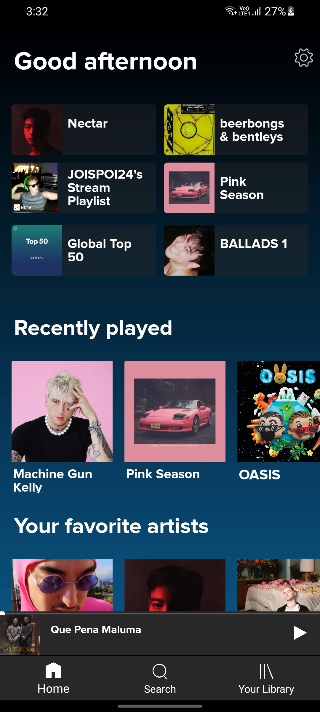
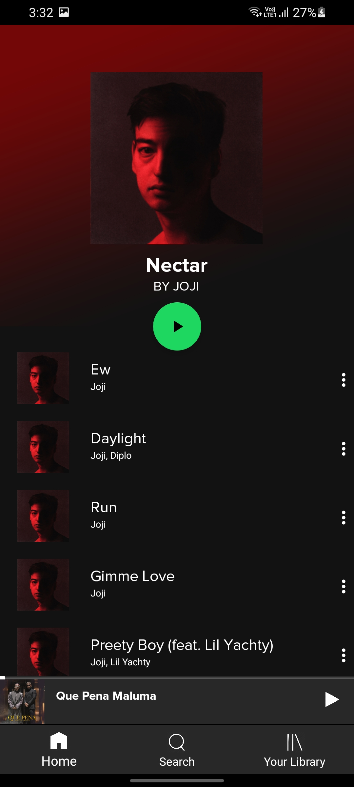

# Spotify UI Clone  
A visually appealing **Spotify UI clone Android app** developed using **Java**. This project demonstrates the creation of a modern and responsive music application interface.

---

## Overview  

  
  

  

This app replicates key design elements of the Spotify application, including a sleek interface, playlists, and navigation.

---

## Features  

- **Modern UI:** A clean and intuitive interface resembling Spotify.  
- **Custom Fonts & Themes:** Customized look and feel using themes, styles, and fonts.  
- **Fragment Usage:** Implements fragments for smooth navigation between pages.  
- **Responsive Design:** Adaptive layouts for different screen sizes.  
- **Scrollable Views:** List and grid views for playlists and music categories.  

---

